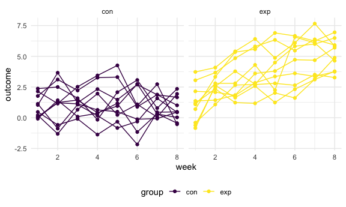

p8105_hw5_ltc2121
================

## Problem 1

Data import and manipulation

``` r
full_df = 
  tibble(
    files = list.files("data/prob1/"),
    path = str_c("data/prob1/", files)
  ) %>% 
  mutate(data = map(path, read_csv)) %>% 
  unnest()
```

    ## Rows: 1 Columns: 8
    ## ── Column specification ────────────────────────────────────────────────────────
    ## Delimiter: ","
    ## dbl (8): week_1, week_2, week_3, week_4, week_5, week_6, week_7, week_8
    ## 
    ## ℹ Use `spec()` to retrieve the full column specification for this data.
    ## ℹ Specify the column types or set `show_col_types = FALSE` to quiet this message.
    ## Rows: 1 Columns: 8
    ## ── Column specification ────────────────────────────────────────────────────────
    ## Delimiter: ","
    ## dbl (8): week_1, week_2, week_3, week_4, week_5, week_6, week_7, week_8
    ## 
    ## ℹ Use `spec()` to retrieve the full column specification for this data.
    ## ℹ Specify the column types or set `show_col_types = FALSE` to quiet this message.
    ## Rows: 1 Columns: 8
    ## ── Column specification ────────────────────────────────────────────────────────
    ## Delimiter: ","
    ## dbl (8): week_1, week_2, week_3, week_4, week_5, week_6, week_7, week_8
    ## 
    ## ℹ Use `spec()` to retrieve the full column specification for this data.
    ## ℹ Specify the column types or set `show_col_types = FALSE` to quiet this message.
    ## Rows: 1 Columns: 8
    ## ── Column specification ────────────────────────────────────────────────────────
    ## Delimiter: ","
    ## dbl (8): week_1, week_2, week_3, week_4, week_5, week_6, week_7, week_8
    ## 
    ## ℹ Use `spec()` to retrieve the full column specification for this data.
    ## ℹ Specify the column types or set `show_col_types = FALSE` to quiet this message.
    ## Rows: 1 Columns: 8
    ## ── Column specification ────────────────────────────────────────────────────────
    ## Delimiter: ","
    ## dbl (8): week_1, week_2, week_3, week_4, week_5, week_6, week_7, week_8
    ## 
    ## ℹ Use `spec()` to retrieve the full column specification for this data.
    ## ℹ Specify the column types or set `show_col_types = FALSE` to quiet this message.
    ## Rows: 1 Columns: 8
    ## ── Column specification ────────────────────────────────────────────────────────
    ## Delimiter: ","
    ## dbl (8): week_1, week_2, week_3, week_4, week_5, week_6, week_7, week_8
    ## 
    ## ℹ Use `spec()` to retrieve the full column specification for this data.
    ## ℹ Specify the column types or set `show_col_types = FALSE` to quiet this message.
    ## Rows: 1 Columns: 8
    ## ── Column specification ────────────────────────────────────────────────────────
    ## Delimiter: ","
    ## dbl (8): week_1, week_2, week_3, week_4, week_5, week_6, week_7, week_8
    ## 
    ## ℹ Use `spec()` to retrieve the full column specification for this data.
    ## ℹ Specify the column types or set `show_col_types = FALSE` to quiet this message.
    ## Rows: 1 Columns: 8
    ## ── Column specification ────────────────────────────────────────────────────────
    ## Delimiter: ","
    ## dbl (8): week_1, week_2, week_3, week_4, week_5, week_6, week_7, week_8
    ## 
    ## ℹ Use `spec()` to retrieve the full column specification for this data.
    ## ℹ Specify the column types or set `show_col_types = FALSE` to quiet this message.
    ## Rows: 1 Columns: 8
    ## ── Column specification ────────────────────────────────────────────────────────
    ## Delimiter: ","
    ## dbl (8): week_1, week_2, week_3, week_4, week_5, week_6, week_7, week_8
    ## 
    ## ℹ Use `spec()` to retrieve the full column specification for this data.
    ## ℹ Specify the column types or set `show_col_types = FALSE` to quiet this message.
    ## Rows: 1 Columns: 8
    ## ── Column specification ────────────────────────────────────────────────────────
    ## Delimiter: ","
    ## dbl (8): week_1, week_2, week_3, week_4, week_5, week_6, week_7, week_8
    ## 
    ## ℹ Use `spec()` to retrieve the full column specification for this data.
    ## ℹ Specify the column types or set `show_col_types = FALSE` to quiet this message.
    ## Rows: 1 Columns: 8
    ## ── Column specification ────────────────────────────────────────────────────────
    ## Delimiter: ","
    ## dbl (8): week_1, week_2, week_3, week_4, week_5, week_6, week_7, week_8
    ## 
    ## ℹ Use `spec()` to retrieve the full column specification for this data.
    ## ℹ Specify the column types or set `show_col_types = FALSE` to quiet this message.
    ## Rows: 1 Columns: 8
    ## ── Column specification ────────────────────────────────────────────────────────
    ## Delimiter: ","
    ## dbl (8): week_1, week_2, week_3, week_4, week_5, week_6, week_7, week_8
    ## 
    ## ℹ Use `spec()` to retrieve the full column specification for this data.
    ## ℹ Specify the column types or set `show_col_types = FALSE` to quiet this message.
    ## Rows: 1 Columns: 8
    ## ── Column specification ────────────────────────────────────────────────────────
    ## Delimiter: ","
    ## dbl (8): week_1, week_2, week_3, week_4, week_5, week_6, week_7, week_8
    ## 
    ## ℹ Use `spec()` to retrieve the full column specification for this data.
    ## ℹ Specify the column types or set `show_col_types = FALSE` to quiet this message.
    ## Rows: 1 Columns: 8
    ## ── Column specification ────────────────────────────────────────────────────────
    ## Delimiter: ","
    ## dbl (8): week_1, week_2, week_3, week_4, week_5, week_6, week_7, week_8
    ## 
    ## ℹ Use `spec()` to retrieve the full column specification for this data.
    ## ℹ Specify the column types or set `show_col_types = FALSE` to quiet this message.
    ## Rows: 1 Columns: 8
    ## ── Column specification ────────────────────────────────────────────────────────
    ## Delimiter: ","
    ## dbl (8): week_1, week_2, week_3, week_4, week_5, week_6, week_7, week_8
    ## 
    ## ℹ Use `spec()` to retrieve the full column specification for this data.
    ## ℹ Specify the column types or set `show_col_types = FALSE` to quiet this message.
    ## Rows: 1 Columns: 8
    ## ── Column specification ────────────────────────────────────────────────────────
    ## Delimiter: ","
    ## dbl (8): week_1, week_2, week_3, week_4, week_5, week_6, week_7, week_8
    ## 
    ## ℹ Use `spec()` to retrieve the full column specification for this data.
    ## ℹ Specify the column types or set `show_col_types = FALSE` to quiet this message.
    ## Rows: 1 Columns: 8
    ## ── Column specification ────────────────────────────────────────────────────────
    ## Delimiter: ","
    ## dbl (8): week_1, week_2, week_3, week_4, week_5, week_6, week_7, week_8
    ## 
    ## ℹ Use `spec()` to retrieve the full column specification for this data.
    ## ℹ Specify the column types or set `show_col_types = FALSE` to quiet this message.
    ## Rows: 1 Columns: 8
    ## ── Column specification ────────────────────────────────────────────────────────
    ## Delimiter: ","
    ## dbl (8): week_1, week_2, week_3, week_4, week_5, week_6, week_7, week_8
    ## 
    ## ℹ Use `spec()` to retrieve the full column specification for this data.
    ## ℹ Specify the column types or set `show_col_types = FALSE` to quiet this message.
    ## Rows: 1 Columns: 8
    ## ── Column specification ────────────────────────────────────────────────────────
    ## Delimiter: ","
    ## dbl (8): week_1, week_2, week_3, week_4, week_5, week_6, week_7, week_8
    ## 
    ## ℹ Use `spec()` to retrieve the full column specification for this data.
    ## ℹ Specify the column types or set `show_col_types = FALSE` to quiet this message.
    ## Rows: 1 Columns: 8
    ## ── Column specification ────────────────────────────────────────────────────────
    ## Delimiter: ","
    ## dbl (8): week_1, week_2, week_3, week_4, week_5, week_6, week_7, week_8
    ## 
    ## ℹ Use `spec()` to retrieve the full column specification for this data.
    ## ℹ Specify the column types or set `show_col_types = FALSE` to quiet this message.

Tidy data

``` r
tidy_df = 
  full_df %>% 
  mutate(
    files = str_replace(files, ".csv", ""),
    group = str_sub(files, 1, 3)) %>% 
  pivot_longer(
    week_1:week_8,
    names_to = "week",
    values_to = "outcome",
    names_prefix = "week_") %>% 
  mutate(week = as.numeric(week)) %>% 
  select(group, subj = files, week, outcome)
```

Plot of observations over time

``` r
tidy_df %>% 
  ggplot(aes(x = week, y = outcome, group = subj, color = group)) + 
  geom_point() + 
  geom_path() + 
  facet_grid(~group)
```



This plot suggests high within-subject correlation – subjects who start
above average end up above average, and those that start below average
end up below average. Subjects in the control group generally don’t
change over time, but those in the experiment group increase their
outcome in a roughly linear way.

## Problem 2

Import raw data and exploration

``` r
raw_washp = 
  read_csv("data/homicide-data.csv") %>% 
  mutate(state = case_when(city == 'Tulsa' ~ 'OK', 
                           TRUE ~ state),
    city_state = str_c(city, state, sep = ", ")) 
```

    ## Rows: 52179 Columns: 12
    ## ── Column specification ────────────────────────────────────────────────────────
    ## Delimiter: ","
    ## chr (9): uid, victim_last, victim_first, victim_race, victim_age, victim_sex...
    ## dbl (3): reported_date, lat, lon
    ## 
    ## ℹ Use `spec()` to retrieve the full column specification for this data.
    ## ℹ Specify the column types or set `show_col_types = FALSE` to quiet this message.

``` r
hom_df = raw_washp %>% 
  group_by(city_state) %>% 
  summarise(total_hom = n(), 
            unsolved_hom = sum(disposition %in% c("Closed without arrest", "Open/No arrest"))) 
hom_df %>% 
  knitr::kable()
```

| city_state         | total_hom | unsolved_hom |
|:-------------------|----------:|-------------:|
| Albuquerque, NM    |       378 |          146 |
| Atlanta, GA        |       973 |          373 |
| Baltimore, MD      |      2827 |         1825 |
| Baton Rouge, LA    |       424 |          196 |
| Birmingham, AL     |       800 |          347 |
| Boston, MA         |       614 |          310 |
| Buffalo, NY        |       521 |          319 |
| Charlotte, NC      |       687 |          206 |
| Chicago, IL        |      5535 |         4073 |
| Cincinnati, OH     |       694 |          309 |
| Columbus, OH       |      1084 |          575 |
| Dallas, TX         |      1567 |          754 |
| Denver, CO         |       312 |          169 |
| Detroit, MI        |      2519 |         1482 |
| Durham, NC         |       276 |          101 |
| Fort Worth, TX     |       549 |          255 |
| Fresno, CA         |       487 |          169 |
| Houston, TX        |      2942 |         1493 |
| Indianapolis, IN   |      1322 |          594 |
| Jacksonville, FL   |      1168 |          597 |
| Kansas City, MO    |      1190 |          486 |
| Las Vegas, NV      |      1381 |          572 |
| Long Beach, CA     |       378 |          156 |
| Los Angeles, CA    |      2257 |         1106 |
| Louisville, KY     |       576 |          261 |
| Memphis, TN        |      1514 |          483 |
| Miami, FL          |       744 |          450 |
| Milwaukee, wI      |      1115 |          403 |
| Minneapolis, MN    |       366 |          187 |
| Nashville, TN      |       767 |          278 |
| New Orleans, LA    |      1434 |          930 |
| New York, NY       |       627 |          243 |
| Oakland, CA        |       947 |          508 |
| Oklahoma City, OK  |       672 |          326 |
| Omaha, NE          |       409 |          169 |
| Philadelphia, PA   |      3037 |         1360 |
| Phoenix, AZ        |       914 |          504 |
| Pittsburgh, PA     |       631 |          337 |
| Richmond, VA       |       429 |          113 |
| Sacramento, CA     |       376 |          139 |
| San Antonio, TX    |       833 |          357 |
| San Bernardino, CA |       275 |          170 |
| San Diego, CA      |       461 |          175 |
| San Francisco, CA  |       663 |          336 |
| Savannah, GA       |       246 |          115 |
| St. Louis, MO      |      1677 |          905 |
| Stockton, CA       |       444 |          266 |
| Tampa, FL          |       208 |           95 |
| Tulsa, OK          |       584 |          193 |
| Washington, DC     |      1345 |          589 |

``` r
##############sig fig issue in the inline code ##################
```

This dataframe contains 52179 rows and 13 columns. Each row represents
an individual criminal homicide. The data includes information from 50
cities across the United States. The reported dates of cases range from
2.0070101^{7} to 2.015111^{8}. The other key variables include details
on victim name, age, race and sex. Another important notice about the
dataframe was that the city Tulsa had been incorrectly matched with the
state AK and needed to be corrected to be matched to the state OK.

Making a Baltimore dataframe & prop.test

``` r
balti_df = hom_df %>% 
  filter(city_state == "Baltimore, MD")

test_res = prop.test(
    x = balti_df %>% pull(unsolved_hom),
    n = balti_df %>% pull(total_hom),
    alternative = c("two.sided"),
    conf.level = 0.95, 
    correct = TRUE) %>% 
  broom::tidy() %>% 
  mutate(conf.low = round(conf.low, 4),
         conf.high = round(conf.high, 4),
    CI = str_c(conf.low, conf.high, sep = "-")) %>% 
  select(estimate, CI)
```

Making function to estimate the proportion of homicides that are
unsolved

``` r
hom_prop = function(df) {
  
 test_res = prop.test(
    x = df %>% pull(unsolved_hom),
    n = df %>% pull(total_hom),
    alternative = c("two.sided"),
    conf.level = 0.95, 
    correct = TRUE) %>% 
  broom::tidy() %>% 
  mutate(conf.low = round(conf.low, 4),
         conf.high = round(conf.high, 4),
    CI = str_c(conf.low, conf.high, sep = "-")) %>% 
  select(estimate, CI)

}
```

Mapping function across all cities

``` r
hom_df_nest = 
  hom_df %>% 
  nest(data = total_hom:unsolved_hom)

hom_df_unnest = hom_df_nest %>% 
  mutate(
    et_CI = map(data, hom_prop)) %>%  
   unnest(et_CI)
```

Estimate of proportion plot

``` r
hom_df_unnest %>% 
  separate(CI, c("low", "high"), "-") %>% 
  mutate(low = as.numeric(low), 
         high = as.numeric(high),
    ci = high - low, 
    city_state = fct_reorder(city_state, estimate)) %>% 
ggplot() +
  geom_point(aes(x = city_state, y = estimate)) +
  geom_errorbar( aes(x = city_state, ymin = estimate - ci, ymax = estimate + ci)) +
  theme(axis.text.x = element_text(angle = 60, hjust = 1, size = 6)) +
   labs(
    title = "Estimated Proportion of Unsolved Homicides",
    x = "US City",
    y = "Proportion")
```


